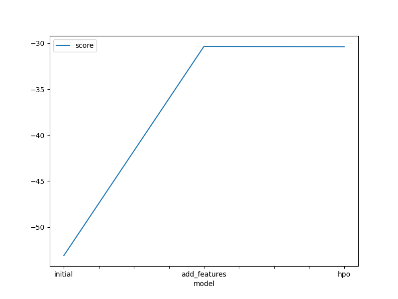
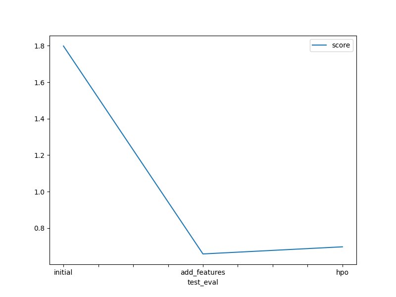

# Report: Predict Bike Sharing Demand with AutoGluon Solution
#### CHAITANYA KORAVI

## Initial Training
### What did you realize when you tried to submit your predictions? What changes were needed to the output of the predictor to submit your results?
When tried to submit predictions, I realized that the Kaggle rejects the negative value after reading the notes in the jupiter notebook. Took care of that eventhough negative values were not produced.

### What was the top ranked model that performed?
The top ranked model was the 'WeightedEnsemble_L3' with a score of 30.33

## Exploratory data analysis and feature creation
### What did the exploratory analysis find and how did you add additional features?
Obtained the features year, month, day and hour from the datetime. Changed the season and weather from intergers to category datatype. Adding new features seemed like improved the performance of the model.

### How much better did your model preform after adding additional features and why do you think that is?
Addition of the additional features made the model perform better by around 114%. I think its because of splitting the datetime feature into individial features like day, month, year and hour. ignoring the columns casual and registered as they were not present in the test dataset. Converting season and weather to the categorical datatypes.

## Hyper parameter tuning
### How much better did your model preform after trying different hyper parameters?
Addition of different hyper parameters made the model perform better by around 110% compared the raw data.

### If you were given more time with this dataset, where do you think you would spend more time?
I'd be spending more time in understanding additional outcomes with Autogluon and a different hyperparameter tuning, presets and time_limit.

### Create a table with the models you ran, the hyperparameters modified, and the kaggle score.
model|    hpo1|    hpo2|    hpo3|    score|
0|    initial|    default|    default|    default|    1.79849|
1|    add_features|    default|    default|    default|    0.65805|
2|    hpo|    hyperparameters_RF|    hyperparameters_XGB|    hyperparameters_KNN|    0.69708|

### Create a line plot showing the top model score for the three (or more) training runs during the project.

TODO: Replace the image below with your own.

### Create a line plot showing the top kaggle score for the three (or more) prediction submissions during the project.

TODO: Replace the image below with your own.

## Summary
submission_new_features.csv had the best performance with best scores which means new features were highly beneficial for improving the model predictive accuracy. submission_new_hpo.csv with both new features and hyperparameter tuning, improved performance compared to the raw submission but still not ad good as the one with just the new features. submission.csv had the worst scores with the raw data. Overall, adding features improved the score, and including hyperparameters further improved it slightly.
